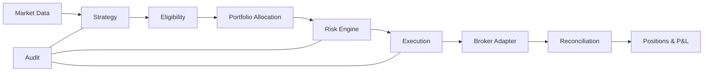

# Components

## Scope

This document assigns ownership and dependency direction inside the modular monolith.

## Assumptions

Interfaces are small and owned by their consumers. Cross-module shared values are strongly typed domain contracts.

## Responsibilities

- Market data normalizes provider input.
- Strategy emits signals only.
- Lifecycle establishes eligibility.
- Portfolio allocates constrained capital.
- Risk approves or rejects proposed exposure.
- Execution owns order state and broker access.
- Reconciliation repairs internal understanding from broker facts.
- Notifications report but never determine trading truth.

## Invariants

- Dependencies flow toward domain policy, never from domain to adapters.
- Allocation and risk precede submission.
- Audit records accompany material decisions.

## Failure Modes

Missing modules, circular dependencies, bypass imports, or untyped shared values can erode safety boundaries.

## Trade-offs

Additional packages and contracts create ceremony but make unsafe coupling visible during review.

## Unresolved Questions

- Exact persistence repositories will be designed with PostgreSQL.
- Accounting and lifecycle policy APIs will be finalized in their implementation phases.

## Acceptance Criteria

- Every requested port has one clear owner.
- Strategy code has no broker capability.
- Paper and future live adapters satisfy the same execution-owned contract.
