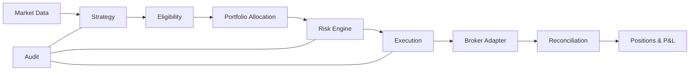

# Components

## Scope

This document assigns ownership and dependency direction inside the modular monolith.

## Assumptions

Interfaces are small and owned by their consumers. Cross-module shared values are strongly typed domain contracts.

## Responsibilities

- Market data normalizes provider input.
- The versioned calendar owns explicit trading days, holidays, sessions, breaks, and expected candle windows.
- Readiness owns immutable watchlists, versioned freshness policies, hierarchical diagnostics, and the future trading-permission gate.
- Telemetry defines a provider-neutral recorder; only the Prometheus adapter and HTTP composition import the Prometheus client.
- Operations HTTP exposes bounded, GET-only diagnostics without provider tokens or local paths.
- Dataset publication owns immutable revisions, build-key idempotency, compare-and-swap generations, lineage, and rollback evidence.
- The instrument master owns canonical instruments and time-bounded provider-token mappings.
- Market-data ingestion validates, deduplicates, reorders, records quality, and writes immutable datasets.
- Replay reads canonical datasets and invokes consumers synchronously in deterministic order.
- Strategy definitions consume immutable, readiness-backed candle frames and
  return exactly one deterministic result: `NO_ACTION`, `OBSERVATION`, or an
  advisory `TRADE_PROPOSAL`, together with the next bounded runtime state.
- The strategy runner owns readiness and lifecycle gating, deterministic
  trigger deduplication, per-instance serialization, bounded cross-instance
  concurrency, cooperative timeouts, panic containment, and the sole call to
  the Milestone 2 atomic publication boundary.
- Strategy replay owns bounded completed-candle buffers and synchronous frame
  dispatch. It has no file-adapter dependency.
- Strategy telemetry is provider-neutral; Prometheus wiring remains in the
  existing metrics adapter.
- Strategy storage owns definition/version registration, lifecycle-revision
  persistence, checksummed runtime checkpoints, evaluation records,
  observations, advisory proposals, and their atomic publication contract.
- The in-memory strategy adapter prepares immutable repository snapshots and
  swaps one snapshot only after optimistic revision and integrity validation.
- Lifecycle establishes eligibility.
- Phase 3 portfolio contracts represent immutable capital, strategy
  allocation, current/incremental/projected exposure, and non-reserving
  allocation candidates.
- Phase 3 risk contracts represent versioned fail-closed policy, pure rule
  inputs/results, typed evidence and violations, aggregate evaluations, and
  non-executable portfolio-risk decisions.
- Milestone 1 repositories register immutable contract values only. Atomic
  reservation and portfolio revision publication are deferred.
- Execution owns order state and broker access.
- Reconciliation repairs internal understanding from broker facts.
- Notifications report but never determine trading truth.

## Invariants

- Dependencies flow toward domain policy, never from domain to adapters.
- Provider tokens never serve as canonical instrument identifiers.
- Only validated canonical quote and completed-candle events may cross into consumers.
- A strategy receives no broker, account, position, order, allocation, or risk
  capability. A proposal contains sizing intent but no executable quantity.
- Strategy versions, configurations, instance revisions, frames, evaluations,
  and proposals have stable content-derived identities.
- An evaluation record, optional output, and its next checkpoint are committed
  together or not at all. Exact canonical retries are idempotent.
- Allocation and risk precede submission.
- Audit records accompany material decisions.
- An allocation candidate is not a reservation. An approved portfolio-risk
  decision is not an execution intent or order and contains no broker or
  account capability.

## Failure Modes

Missing modules, circular dependencies, bypass imports, or untyped shared values can erode safety boundaries.

## Trade-offs

Additional packages and contracts create ceremony but make unsafe coupling visible during review.

## Unresolved Questions

- Exact persistence repositories will be designed with PostgreSQL.
- Accounting and lifecycle policy APIs will be finalized in their implementation phases.

## Acceptance Criteria

- Every requested port has one clear owner.
- Strategy code has no broker capability.
- Paper and future live adapters satisfy the same execution-owned contract.
- Prometheus imports are confined to `internal/adapters/metrics/prometheus` and HTTP composition.
- Calendar, readiness, correction, and operations packages contain no strategy or broker capability.
- Strategy contracts import only provider-neutral domain, market-data model,
  and readiness types.
- Strategy storage contracts do not import the in-memory adapter.
- Runner, replay, and the engineering fixture import no broker, execution,
  account, risk, allocation, order, position, or provider SDK package.
