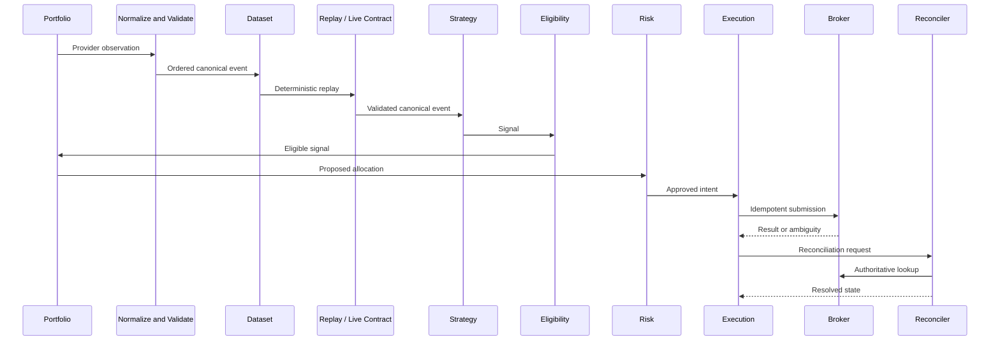

# Data Flow

## Scope

This document defines the authoritative flow from external market data to reconciled state.

## Assumptions

Events carry timestamps and correlation identifiers. Linked legs share an execution-intent identifier.

## Responsibilities

Each stage validates its inputs, records its decision, and passes an explicit typed result to the next stage.

## Invariants

- A rejected or missing decision halts the flow.
- Malformed, duplicate, or too-late market observations never enter the canonical consumer stream.
- Equal exchange timestamps are ordered by provider sequence when available, then event ID.
- Timeouts are ambiguous, not failures.
- Reconciliation precedes retry when submission outcome is unknown.
- Alerts never substitute for persisted truth.

## Failure Modes

Stale or out-of-order market data, duplicate signals, allocation races, expired risk decisions, partial legs, and lost responses are contained and audited.

## Trade-offs

Synchronous control flow is simpler initially but may add latency. Messaging is deferred until measured load or isolation demands it.

## Unresolved Questions

- Event-retention and replay formats will be fixed during market-data design.
- Maximum decision age will be risk-policy configuration.

## Acceptance Criteria

- Every order can be traced to market evidence, signal, allocation, and risk decision.
- Every ambiguous outcome routes to reconciliation.
- There is no direct strategy-to-broker path.
