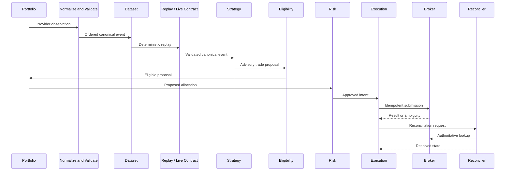
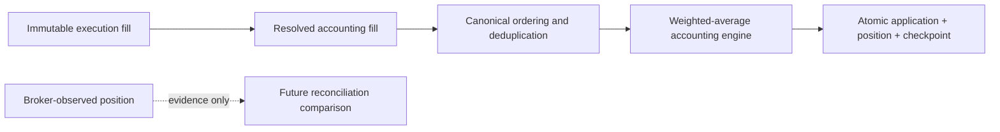
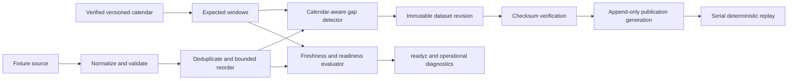
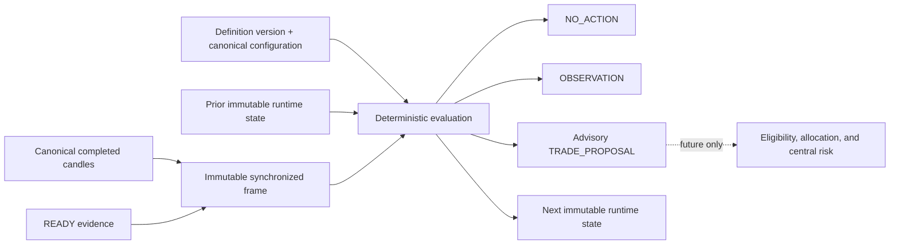
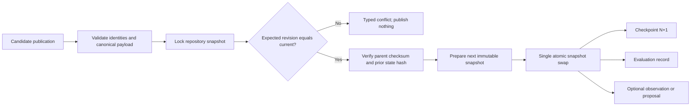
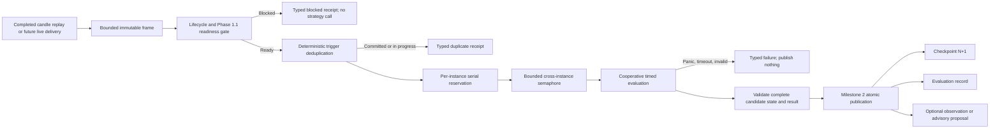
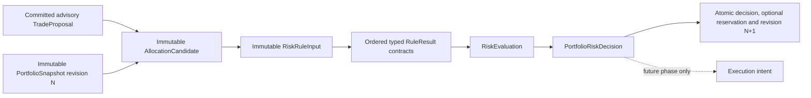

# Data Flow

## Scope

This document defines the authoritative flow from external market data to reconciled state.

## Assumptions

Events carry timestamps and correlation identifiers. Linked legs share an execution-intent identifier.

## Responsibilities

Each stage validates its inputs, records its decision, and passes an explicit typed result to the next stage.

## Invariants

- A rejected or missing decision halts the flow.
- Malformed, duplicate, or too-late market observations never enter the canonical consumer stream.
- Equal exchange timestamps are ordered by provider sequence when available, then event ID.
- Timeouts are ambiguous, not failures.
- Reconciliation precedes retry when submission outcome is unknown.
- Alerts never substitute for persisted truth.

## Failure Modes

Stale or out-of-order market data, duplicate signals, allocation races, expired risk decisions, partial legs, and lost responses are contained and audited.

## Trade-offs

Synchronous control flow is simpler initially but may add latency. Messaging is deferred until measured load or isolation demands it.

## Unresolved Questions

- Event-retention and replay formats will be fixed during market-data design.
- Maximum decision age will be risk-policy configuration.

## Acceptance Criteria

- Every order can be traced to market evidence, evaluation, advisory proposal,
  allocation, and risk decision.
- Every future order can be traced to a stable evaluation and advisory proposal,
  followed by separate eligibility, allocation, and risk decisions.
- Every ambiguous outcome routes to reconciliation.
- There is no direct strategy-to-broker path.

## Phase 6 Milestone 1 Accounting Boundary

Occurrence time, normalized receipt time, and fill identity define the total
order. Reports without fills and broker position snapshots cannot change M1
accounting. A canonical predecessor discovered after committed state fails
closed pending verified replay.

## Phase 1.1 Operational Flow

Only a complete verified dataset can be published. Publication uses an expected-current ID; rollback appends a generation. Live-equivalent consumers still receive the same canonical event contract and synchronous backpressure remains explicit.

## Phase 2 Milestone 1 Evaluation Boundary

Single-stream definitions use a one-series frame. Multi-instrument definitions
declare either exact-close synchronization or latest-completed input semantics.
Missing, stale, or non-ready required data prevents construction of a valid
evaluation context. Milestone 3 supplies the bounded runner and replay
boundary; eligibility, allocation, risk, and execution remain later phases.

## Phase 2 Milestone 2 Atomic Publication

The evaluation ID is the publication idempotency identity. A retry is accepted
only when the canonical publication bytes and checksum match exactly. Reusing
the ID with different content is an integrity violation. A stale expected
revision, corrupt lineage, cancellation, capacity exhaustion, or injected
pre-commit failure leaves every repository view unchanged.

## Phase 2 Milestone 3 Evaluation Runtime

The caller is the queue: semaphore acquisition and replay delivery are
synchronous, so backpressure is explicit and no event is silently dropped.
The keyed reservation is removed on every terminal path. Shutdown first closes
admission, cancels accepted work, and waits for the bounded reservation set.

## Phase 3 Milestone 2 Decision Runtime

The runner reads exactly revision `N`, constructs one deterministic candidate,
and invokes rules sequentially in canonical policy order. One keyed admission
slot prevents overlapping authoritative work for a portfolio; a fixed semaphore
bounds different portfolios. The atomic publisher validates complete parent and
child lineage and performs one compare-and-swap commit. Exact committed retries
return the existing receipt. A stale revision is returned to the caller and is
never silently evaluated against newer state.

Milestone 1 constructs and validates values; it does not run rules, consume
proposals, reserve capital, mutate portfolio state, publish checkpoints, or
create execution artifacts. Identical proposal, snapshot, configuration,
policy order, evidence, and injected timestamps produce identical canonical
bytes and identities.
