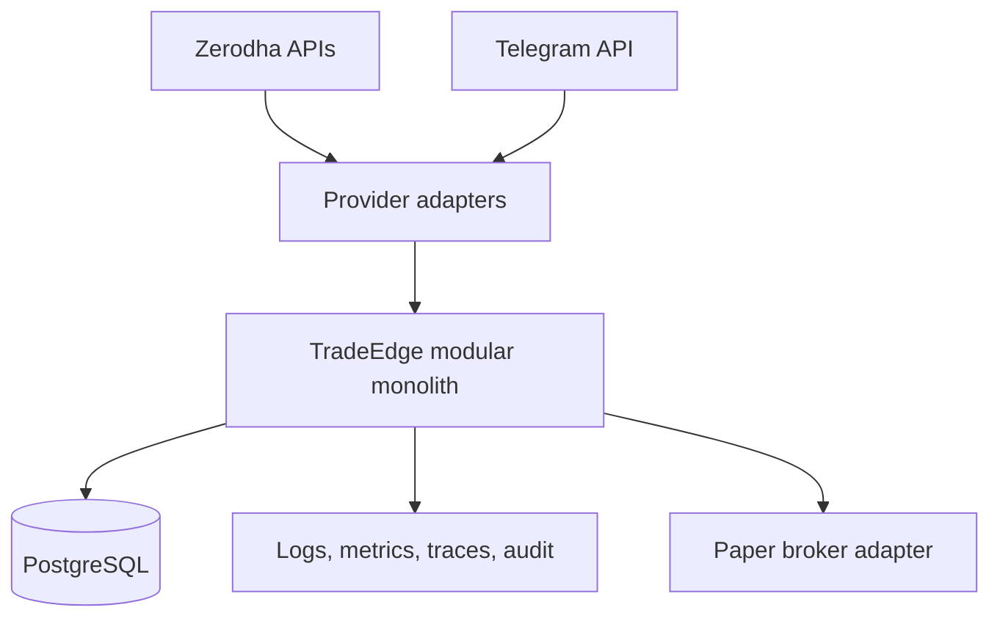

# System Architecture

## Scope

TradeEdge begins as a Go modular monolith deployed as a Linux container with a static outbound public IP. PostgreSQL is the future durable store; Redis and messaging are excluded until demonstrated needs justify them.

Phase 5 composes Zerodha observations through an adapter-local stream and
mapping boundary. PAPER/SHADOW execution continues through the provider-neutral
Phase 4 coordinator and atomic OMS publication, backed only by a deterministic
paper broker. SHADOW translation is observational and cannot reach a mutation
transport.

Phase 6 Milestone 1 adds a provider-neutral accounting module after the OMS.
It accepts only immutable fills with resolved TradeEdge portfolio, instrument,
side, and receipt evidence. Its atomic repository re-applies each transition
before committing the fill application, position revision, and checkpoint.

Phase 6 Milestone 2 validates complete OMS lineage and a versioned
portfolio/account binding before extending that transaction with ingestion
progress. A separate reconciler compares stable position revisions with
provider-neutral broker observations and can publish evidence only.

Phase 6 Milestone 3 derives immutable position valuations and an atomic
portfolio financial snapshot from stable accounting and canonical market-data
revision sets. The financial module has no accounting-write or broker port;
Phase 3 consumes it through a consumer-owned provider-neutral boundary.

Phase 7 Milestone 1 adds one orchestration owner above these modules. It
aggregates mode-specific readiness, derives session/CAS state from the
versioned exchange calendar, restores a consistent set of subsystem heads
before activation, and applies bounded synchronous backpressure. It does not
replace any subsystem's atomic publication boundary.

Phase 8 M1 adds one provider-neutral EMA crossover definition under the Phase 2
runner. It consumes only canonical completed candles, separates an
observation-only signal instrument from an explicitly configured tradable
PAPER instrument, and emits advisory proposals. It has no broker, risk,
accounting, credential, HTTP-mutation, or Zerodha dependency.

Phase 8 M2 adds provider-neutral derivatives selection. NIFTY spot owns signal
evidence, a resolved future owns forward selection context, and the selected
option quote owns PAPER fill and valuation. No Zerodha mutation port is added.
The connected M2 boundary is composition only: the provider-neutral proposal
enters the released Phase 3 runner, an approved PAPER decision becomes a Phase
4 intent/plan/order, and committed PAPER fills enter Phase 6 accounting and
valuation. SHADOW returns after the committed risk decision. A reducing SELL
is executable only when explicitly labelled as reducing exposure and matched
to the authoritative open option; ordinary SELL legs retain protective-buy
dependency enforcement.

## Assumptions

One active process is initially sufficient. External services are slow, unavailable, duplicated, or ambiguous at arbitrary times.

## Responsibilities

The monolith isolates domain modules, owns orchestration, applies timeouts and cancellation, persists decisions, and exposes operational probes.

## Invariants

- Domain packages do not depend on broker SDKs or HTTP handlers.
- Strategies cannot reach a broker.
- The execution module owns the broker port.
- Phase 4 execution contracts derive authority only from positive Phase 3
  decisions and keep TradeEdge order identity independent of broker identity.
- The OMS atomically publishes each order transition with its report and
  optional fill under optimistic revision control.
- Phase 4 operational HTTP is bounded and GET-only; its telemetry and health
  views are provider-neutral and cannot invoke broker operations.
- Execution metrics use finite lifecycle dimensions and never use TradeEdge,
  broker, account, or instrument identities as labels.
- PostgreSQL is authoritative for internal durable state; broker state is authoritative for actual external orders and positions.
- M1 local accounting is derived only from immutable fills. Broker-observed
  positions are reconciliation evidence and cannot directly mutate quantity,
  cost basis, or realized P&L.
- M2 ingestion progress is atomic with its application and position revision.
  The reconciliation package has no accounting-write or broker-mutation port.
- M3 market prices are valuation inputs only. Incomplete or stale financial
  state is explicit and cannot satisfy valuation-dependent risk rules.
- PAPER/SHADOW are the only pipeline-capable runtime modes. OFFLINE and
  LIVE_DISABLED cannot become trading-ready, and no live-enabled route exists.
- SHADOW has one hypothetical fill-derived TradeEdge book; real broker
  positions remain non-comparable observation evidence.

## Failure Modes

Split-brain execution, database unavailability, stale data, adapter timeouts, and reconciliation disagreement cause readiness loss and block new orders.

## Trade-offs

A modular monolith limits deployment complexity and preserves transactional options. Horizontal execution and asynchronous messaging are deferred.

## Unresolved Questions

- Production hosting, backup objectives, and active-owner coordination require later decisions.
- PostgreSQL schema design is outside Phase 0.

## Acceptance Criteria

- Package dependencies reflect the pipeline.
- Adapters can be replaced without changing domain policy.
- No forbidden infrastructure or live route exists in Phase 0.
