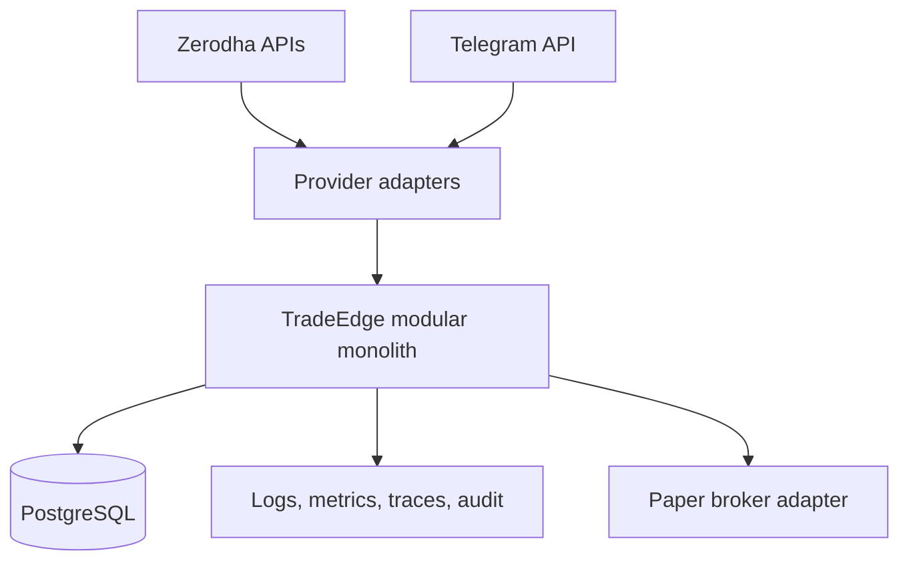

# System Architecture

## Scope

TradeEdge begins as a Go modular monolith deployed as a Linux container with a static outbound public IP. PostgreSQL is the future durable store; Redis and messaging are excluded until demonstrated needs justify them.

## Assumptions

One active process is initially sufficient. External services are slow, unavailable, duplicated, or ambiguous at arbitrary times.

## Responsibilities

The monolith isolates domain modules, owns orchestration, applies timeouts and cancellation, persists decisions, and exposes operational probes.

## Invariants

- Domain packages do not depend on broker SDKs or HTTP handlers.
- Strategies cannot reach a broker.
- The execution module owns the broker port.
- Phase 4 execution contracts derive authority only from positive Phase 3
  decisions and keep TradeEdge order identity independent of broker identity.
- The OMS atomically publishes each order transition with its report and
  optional fill under optimistic revision control.
- Phase 4 operational HTTP is bounded and GET-only; its telemetry and health
  views are provider-neutral and cannot invoke broker operations.
- Execution metrics use finite lifecycle dimensions and never use TradeEdge,
  broker, account, or instrument identities as labels.
- PostgreSQL is authoritative for internal durable state; broker state is authoritative for actual external orders and positions.

## Failure Modes

Split-brain execution, database unavailability, stale data, adapter timeouts, and reconciliation disagreement cause readiness loss and block new orders.

## Trade-offs

A modular monolith limits deployment complexity and preserves transactional options. Horizontal execution and asynchronous messaging are deferred.

## Unresolved Questions

- Production hosting, backup objectives, and active-owner coordination require later decisions.
- PostgreSQL schema design is outside Phase 0.

## Acceptance Criteria

- Package dependencies reflect the pipeline.
- Adapters can be replaced without changing domain policy.
- No forbidden infrastructure or live route exists in Phase 0.
