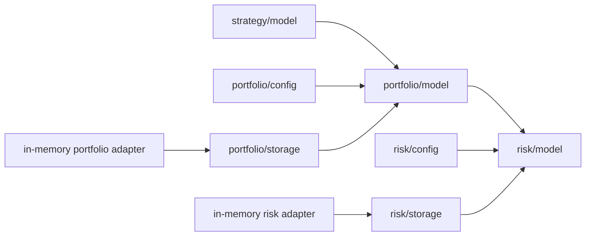

# Phase 3: Portfolio and Risk Decisions

## Milestone 1 Scope

Milestone 1 defines deterministic contracts and validation for:

`TradeProposal -> AllocationCandidate -> RiskEvaluation -> PortfolioRiskDecision`

It contains no runner, rule orchestration, automatic rule execution, capital
reservation, authoritative portfolio mutation, execution intent, order,
broker call, operational API, metric wiring, or replay workflow.

## Dependency Direction



Domain packages do not import adapters, HTTP, Prometheus, execution, broker,
reconciliation, or provider packages. Risk rules receive immutable inputs and
cannot fetch data, call another rule, mutate state, use wall time, or generate
random identity.

The unused Phase 0 `Signal`, `Allocation`, and two-outcome `RiskDecision`
placeholders and their empty portfolio/risk ports were removed. They had no
consumers and were not Phase 2 contracts. Phase 2 proposal, storage, runner,
and replay APIs remain unchanged. Its canonical JSON implementation now
delegates to the shared implementation with identical accepted behavior.

## Authoritative Arithmetic

- Money and P&L use integer minor units.
- Capital buckets are non-negative and share one base currency.
- Signed P&L and net directional exposure are allowed.
- Percentages use integer basis points in `[0, 10000]`.
- Leverage uses a reduced integer rational.
- Checked add, subtract, and multiply fail on overflow.
- Unknown, unavailable, and not-applicable exposure are distinct from known
  zero.

The Milestone 1 capital invariant is:

`TotalCapital = AvailableCapital + ReservedCapital + DeployedCapital`

Current equity is:

`CurrentEquity = TotalCapital + RealizedPnL + UnrealizedPnL`

The first equation classifies capital usage; the second captures signed
mark-to-market effects. No broker balance or account concept is inferred.

## Immutable Portfolio Snapshot

A snapshot binds one portfolio revision to exchange/as-generated timestamps,
trading date, base currency, configuration identity/hash, capital buckets,
signed P&L windows, high-water mark, equity, deterministic strategy allocation
and exposure collections, control state, and a source checksum.

Collections are bounded, sorted, copied on input/output, and included in the
snapshot identity. Accounting disagreement, currency mismatch, invalid
control state, duplicate identity, overflow, or collection overflow rejects
construction.

## Exposure and Allocation Candidate

Exposure records identify a provider-neutral dimension and subject and retain
gross, net directional, premium, long, short, paid/received premium, maximum
loss knowledge, and overnight state. Current, incremental, and projected
exposure remain separate. Projection uses checked arithmetic, and unknown
maximum loss never becomes zero.

A strategy allocation is platform-owned. Strategy `SizingIntent` is advisory.
An allocation candidate binds the proposal and portfolio revision to bounded
capital, premium/risk knowledge, optional canonical-master quantity bounds,
incremental/projected exposure, reserve impact, rounding evidence,
constraints, and typed reasons. It neither reserves capital nor mutates a
snapshot. Quantity bounds are portfolio constraints, not executable order
quantity.

## Risk Contracts

Risk policies contain a bounded, statically registered set of unique versioned
rules in contiguous deterministic order. Unknown or duplicate rules and
conflicting order fail configuration.

Rules implement one pure contract:

```text
Evaluate(context.Context, RiskRuleInput) RuleResult
```

Results are exactly `PASS`, `VIOLATION`, `MODIFICATION_REQUIRED`, `DEFER`, or
`ERROR`. Technical errors are not ordinary policy violations. Evidence is a
bounded typed structure with availability, observed/limit/projected/headroom
values, comparator, unit, subject, source identities, formula version,
timestamp, and explanation.

Violations carry an explicit severity and effect. Severity never implicitly
selects behavior. Policies are fail-closed.

## Decision Boundary

`PortfolioRiskDecision` supports `APPROVED`, `MODIFIED`, `REJECTED`, and
`DEFERRED`.

- APPROVED contains allocation bounds equal to the candidate.
- MODIFIED contains a strict subset of candidate capital or leg bounds and
  explicit constraints; it can never increase either bound.
- REJECTED and DEFERRED contain no approved allocation.
- Every outcome references one proposal, portfolio snapshot/revision,
  allocation candidate, risk evaluation, policy/configuration hashes,
  ordered reasons and violations, evidence checksum, generation time, and
  expiry.

An approved decision is an internal authorization artifact only. It contains
no account, broker token, broker request, exchange order/product type, client
request ID, or order payload and cannot be submitted to a broker.

All approved capital, leg bounds, constraints, and validity participate in the
canonical decision bytes, checksum, and identity. Outcome validation is tied
to the aggregate rule statuses: all-pass for APPROVED, at least one safe
modification for MODIFIED, a definitive violation for REJECTED, and a defer or
technical failure for DEFERRED.

## Configuration and Persistence

Portfolio and risk configuration use the same accepted canonical JSON
mechanism as Phase 2. Documents are at most 256 KiB, integer-only, depth and
collection bounded, and strict about duplicate and unknown fields.

Repositories provide deterministic immutable registration and reads, typed
not-found/capacity/collision errors, exact duplicate idempotency, defensive
copies, cancellation, and deterministic enumeration. The in-memory adapters
are reference implementations; they deliberately do not fake the future
transactional boundary.

## Bounded Assumptions

- one portfolio and one base currency;
- 1-5 definitions and at most 20 strategy instances;
- 10-100 instruments and fewer than 100 exposure records;
- fewer than 50 rules and 10 proposals per minute;
- fewer than 10,000 decisions per trading day;
- snapshot and canonical decision documents below 1 MiB;
- later allocation/risk runtime target below 10 ms;
- runtime timeout and durable persistence are deferred.

## Deferred Milestones

Milestone 2 will design the bounded decision runner, proposal consumption,
optimistic revision handling, and atomic publication of decision, reservation,
and revision `N+1`.

Milestone 3 will add reviewed reference rule implementations, replay
integration, telemetry, read-only operational APIs, stress evidence, and
paper-pipeline composition.

Neither milestone authorizes live trading or direct broker execution.

## Milestone 1 Completion Checklist

- [x] Immutable revisioned portfolio snapshots and capital accounting.
- [x] Integer-only checked money, ratios, quantities, P&L, and exposure.
- [x] Explicit current, incremental, projected, unknown, and unbounded risk.
- [x] Platform-owned strategy allocations and non-reserving candidates.
- [x] Pure provider-neutral rule, evidence, violation, and evaluation contracts.
- [x] Deterministic non-executable decisions with four exclusive outcomes.
- [x] Kill-switch and circuit-breaker state contracts.
- [x] Bounded canonical portfolio and risk configuration.
- [x] Provider-neutral repositories with idempotency and collision rejection.
- [x] Deterministic identity, canonical-output, overflow, boundary, and
  repository contract tests.
- [x] No runner, orchestration, mutation, reservation, replay, telemetry, HTTP,
  production rule, broker, OMS, order, position, or execution capability.
