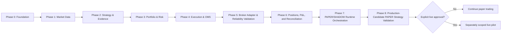

# Product Roadmap

## Scope

This roadmap sequences bounded milestones from foundation through independently approved live-readiness assessment.

## Assumptions

Each phase has objective entry and exit criteria. Passing a technical milestone does not authorize live trading.

## Responsibilities

- Phase 0 establishes types, ports, configuration, observability foundations, and paper-only runtime.
- Phase 1 establishes reliable normalized market data.
- Phase 2 adds deterministic strategy evidence.
- Phase 3 establishes portfolio/risk decisions, bounded rule execution, atomic
  reservations, operational controls, and release evidence.
- Phase 4 establishes provider-neutral execution/OMS contracts before adding a
  deterministic paper broker, bounded operations, and machine-readable
  execution reliability evidence. Phase 4 closure remains paper-only.
- Phase 5 may design a Zerodha adapter behind the broker port and exercise it
  only through controlled paper integration, reliability validation, and
  failure drills; live orders remain separately approval-gated.
- Phase 5 closes with OFFLINE/PAPER/SHADOW observation and release evidence;
  LIVE_DISABLED remains blocked. Phase 6 begins authoritative positions, fills,
  P&L, and broker reconciliation without inheriting live-order authorization.
- Phase 6 Milestone 1 establishes immutable-fill-driven weighted-average
  positions and gross realized P&L. Milestone 2 adds authoritative OMS fill
  ingestion, atomic progress, and non-mutating broker-position reconciliation.
  Milestone 3 adds deterministic canonical-LTP valuation, explicit incomplete
  financial state, provider-neutral risk input, and Phase 6 release evidence.
- Phase 7 Milestone 1 composes Phases 1-6 into a calendar-driven, bounded,
  restartable PAPER/SHADOW runtime with CAS regimes and no broker mutation.
- Phase 7 Milestone 3 supplies the fail-closed full-day, adversarial, restart,
  replay, isolation, resource, regression, and operational evidence required
  to close PAPER/SHADOW orchestration. It adds no live authority.
- Phase 8 adds one explicitly approved production-candidate strategy to the
  existing PAPER pipeline, first through deterministic evidence and then
  through checksum-authorized full-pipeline sessions. It grants no live
  authority.

## Invariants

- Only one major milestone is implemented at a time.
- Safety evidence cannot be waived to preserve schedule.
- Live enablement requires a separate design and approval.

## Failure Modes

Schedule pressure, incomplete evidence, flaky dependencies, or unresolved state must delay progression rather than reduce controls.

## Trade-offs

Sequential gates slow feature delivery but reduce coupled failure risk and make readiness evidence auditable.

## Unresolved Questions

- Numeric readiness thresholds and observation duration remain approval-gated.
- Disaster-recovery objectives must be set before production deployment.

## Acceptance Criteria

- Each phase has bounded deliverables and verification.
- Dependencies between phases are explicit.
- No roadmap phase silently enables real orders.
