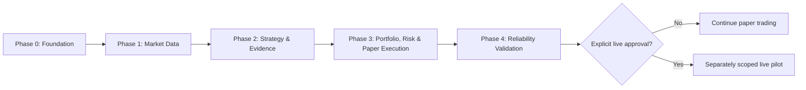

# Product Roadmap

## Scope

This roadmap sequences bounded milestones from foundation through independently approved live-readiness assessment.

## Assumptions

Each phase has objective entry and exit criteria. Passing a technical milestone does not authorize live trading.

## Responsibilities

- Phase 0 establishes types, ports, configuration, observability foundations, and paper-only runtime.
- Phase 1 establishes reliable normalized market data.
- Phase 2 adds deterministic strategy evidence.
- Phase 3 begins with portfolio/risk decision contracts before separately
  adding bounded rule execution, atomic reservations, and paper execution.
- Later phases add reliability evidence and failure drills.

## Invariants

- Only one major milestone is implemented at a time.
- Safety evidence cannot be waived to preserve schedule.
- Live enablement requires a separate design and approval.

## Failure Modes

Schedule pressure, incomplete evidence, flaky dependencies, or unresolved state must delay progression rather than reduce controls.

## Trade-offs

Sequential gates slow feature delivery but reduce coupled failure risk and make readiness evidence auditable.

## Unresolved Questions

- Numeric readiness thresholds and observation duration remain approval-gated.
- Disaster-recovery objectives must be set before production deployment.

## Acceptance Criteria

- Each phase has bounded deliverables and verification.
- Dependencies between phases are explicit.
- No roadmap phase silently enables real orders.
