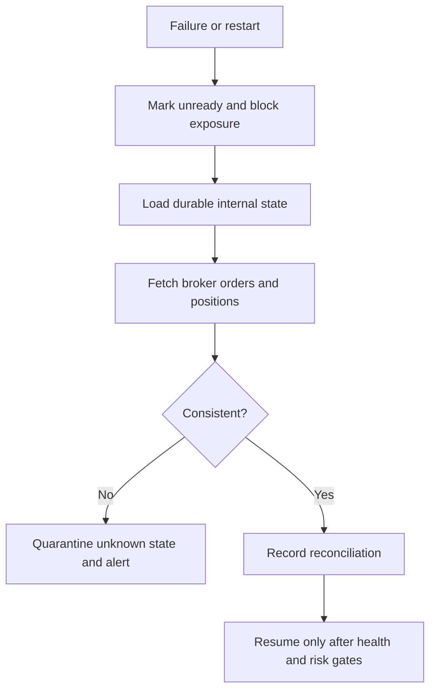

# Failure Recovery

## Scope

Recovery restores a safe understanding of orders, positions, and operational ownership after dependency or process failure.

## Assumptions

External calls are bounded and cancellable. Broker facts supersede internal assumptions about actual orders and positions.

## Responsibilities

Recovery detects incomplete transitions, reconciles broker state, repairs derived views, preserves evidence, and requires explicit safety gates before resuming.

Market-data recovery additionally verifies dataset schema and SHA-256 checksums before replay. Incomplete temporary datasets are never opened, and stale or missing required data remains fail-closed.

Calendar failure is explicit: a verified version may be reused only inside its declared range. A correction creates a complete child revision after verifying its parent and inputs. Repeated builds use a deterministic key; disagreement for one key is corruption. Publication and rollback append checksummed generations using expected-current conflict detection.

Strategy-state recovery decodes a versioned canonical checkpoint and verifies
its SHA-256 checksum, strategy instance, definition/version, configuration hash,
instance revision, state schema, state revision, and parent-checksum lineage.
Any mismatch fails closed. Evaluation publication uses optimistic revision
control: only `N+1` may follow revision `N`, and checkpoint, evaluation record,
observation, and advisory proposal share one atomic commit boundary.

The Milestone 3 runner treats timeouts, cancellation, panics, invalid output,
revision conflicts, and storage failures as non-committed attempts. Their
trigger may be retried because no committed evaluation identity exists.
Committed triggers return an idempotent duplicate outcome. A revision conflict
is surfaced without re-running strategy code. Panic values and stacks are
bounded, and a later trigger or safe retry can proceed after keyed state is
retired.

Phase 3 Milestone 2 restores only verified portfolio checkpoints. Every
non-genesis checkpoint binds its parent snapshot/checksum, proposal, trigger,
decision, optional reservation, and resulting snapshot checksum. Continuation
from a restored checkpoint is byte-equivalent to uninterrupted serial replay.
Timeout, cancellation, panic, invalid allocation/rule output, storage failure,
and revision conflict publish no artifacts or portfolio revision. Unknown or
unavailable exposure is explicit and never restored as known zero. Identity
reuse with changed canonical content is an integrity collision.
The in-memory adapters are not durable and are not an authoritative restart
mechanism.

## Invariants

- Startup does not place orders while reconciliation is incomplete.
- Recovery never deletes conflicting evidence.
- Published historical datasets are immutable; corrected history is a new revision.
- A strategy proposal or observation cannot be restored without its evaluation
  record and committed checkpoint.
- Failed or cancelled strategy publication cannot advance authoritative state.
- Shutdown rejects new evaluation reservations, cancels accepted work, and
  waits within the application shutdown deadline.
- Notifications are not authoritative.

## Failure Modes

Database loss, stale broker responses, split ownership, clock skew, repeated
restarts, partial reconciliation, checkpoint corruption, stale strategy
revisions, and identity reuse with changed content can leave uncertainty.

## Trade-offs

Manual containment may be required when automatic evidence is insufficient.

## Unresolved Questions

Recovery time and recovery point objectives require production infrastructure decisions.

## Acceptance Criteria

- Failure drills have deterministic safe outcomes.
- Unknown state remains visible and blocks exposure.
- Resume actions and evidence are audited.
- Incomplete generation directories are ignored, rollback retains every prior generation, and corrupt inputs cannot become current.
- Corrupt or mismatched strategy checkpoints are rejected, exact publication
  retries are idempotent, and injected commit failure exposes no partial state.
- Deterministic replay resumed from a verified intermediate checkpoint produces
  the same IDs, checkpoint bytes, checksums, proposal identities, and final
  state as uninterrupted replay.
