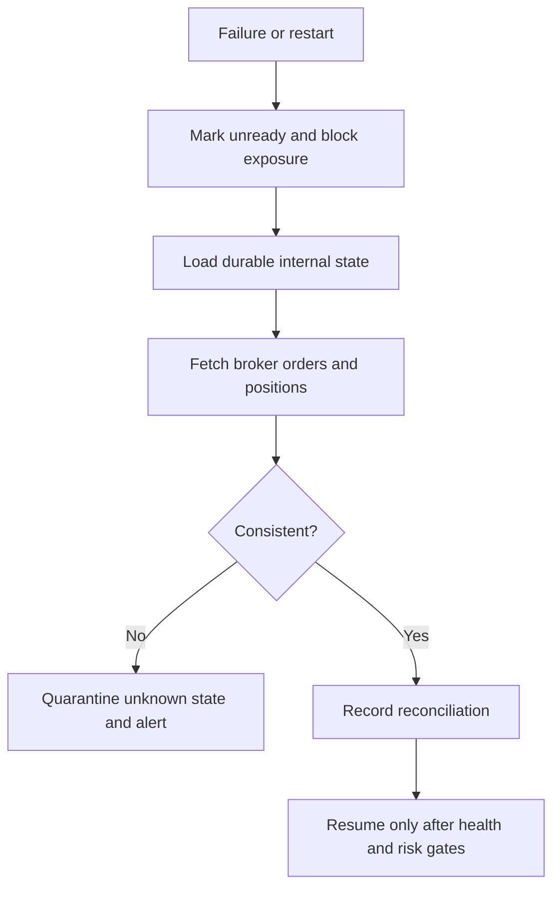

# Failure Recovery

## Scope

Recovery restores a safe understanding of orders, positions, and operational ownership after dependency or process failure.

## Assumptions

External calls are bounded and cancellable. Broker facts supersede internal assumptions about actual orders and positions.

## Responsibilities

Recovery detects incomplete transitions, reconciles broker state, repairs derived views, preserves evidence, and requires explicit safety gates before resuming.

Market-data recovery additionally verifies dataset schema and SHA-256 checksums before replay. Incomplete temporary datasets are never opened, and stale or missing required data remains fail-closed.

Calendar failure is explicit: a verified version may be reused only inside its declared range. A correction creates a complete child revision after verifying its parent and inputs. Repeated builds use a deterministic key; disagreement for one key is corruption. Publication and rollback append checksummed generations using expected-current conflict detection.

## Invariants

- Startup does not place orders while reconciliation is incomplete.
- Recovery never deletes conflicting evidence.
- Published historical datasets are immutable; corrected history is a new revision.
- Notifications are not authoritative.

## Failure Modes

Database loss, stale broker responses, split ownership, clock skew, repeated restarts, and partial reconciliation can leave uncertainty.

## Trade-offs

Manual containment may be required when automatic evidence is insufficient.

## Unresolved Questions

Recovery time and recovery point objectives require production infrastructure decisions.

## Acceptance Criteria

- Failure drills have deterministic safe outcomes.
- Unknown state remains visible and blocks exposure.
- Resume actions and evidence are audited.
- Incomplete generation directories are ignored, rollback retains every prior generation, and corrupt inputs cannot become current.
