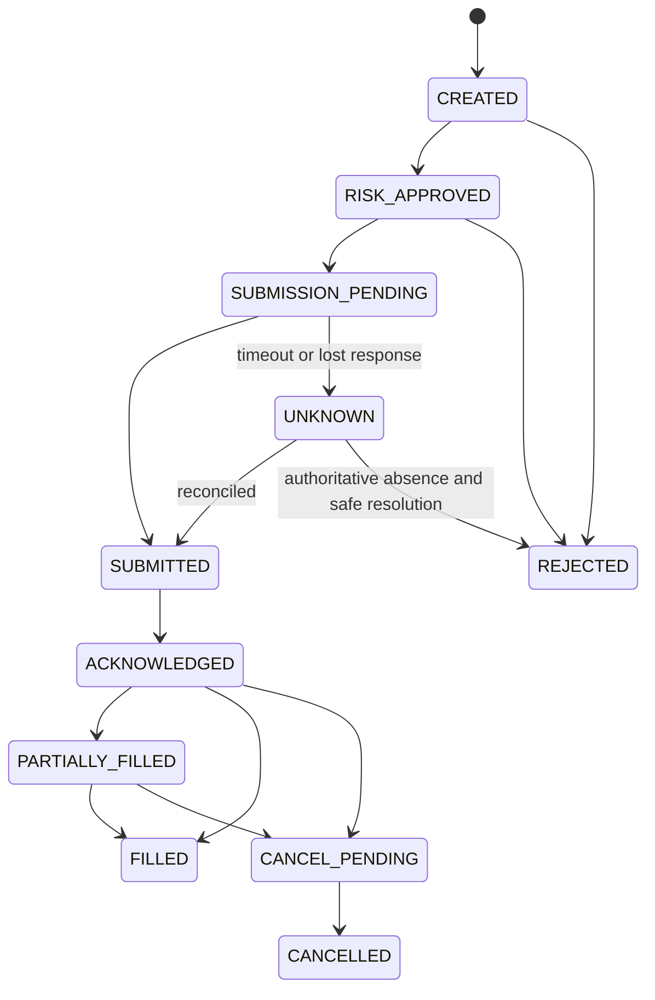

# Order Safety

## Scope

Order execution is an explicit state machine with idempotency, ambiguity handling, and mandatory reconciliation.

## Assumptions

Broker submission may succeed even when the response times out. Linked legs are not assumed atomic.

## Responsibilities

Execution assigns stable client request IDs, persists intent before submission, validates state transitions, and requests reconciliation for ambiguity.

## Invariants

- Timeout never implies failure.
- Unknown state blocks retry and new exposure until resolved.
- Duplicate prevention survives caller retries.
- Cancellation is a request until broker-confirmed.

## Failure Modes

Lost responses, duplicated requests, partial fills, late events, conflicting broker records, and restart gaps can create duplicate or unmanaged exposure.

## Trade-offs

Reconciliation delays recovery but is safer than blind retry.

## Unresolved Questions

Provider-specific correlation mechanisms and reconciliation schedules will be confirmed with Zerodha behavior.

## Acceptance Criteria

- Invalid transitions are rejected and audited.
- All submissions have stable request identity.
- Ambiguity has no direct retry path.
