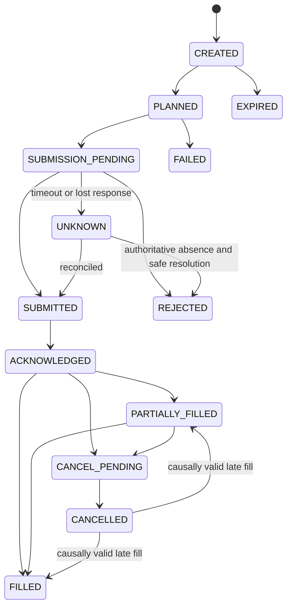

# Order Safety

## Scope

Order execution is an explicit state machine with idempotency, ambiguity handling, and mandatory reconciliation.

## Assumptions

Broker submission may succeed even when the response times out. Linked legs are not assumed atomic.

## Responsibilities

Phase 3 authority is represented by an immutable execution intent rather than
an order state. Execution assigns stable client-order IDs, persists intent and
plan before submission, validates state transitions, and requests future
reconciliation for ambiguity.

The Phase 4 M2 coordinator schedules canonical plan order with bounded
cross-plan concurrency and per-order serialization. A protective BUY dependency
must be fully filled before its dependent exposure-increasing SELL is eligible.
The deterministic paper broker and future adapters share the same
provider-neutral port. Duplicate and stale events are harmless; changed content
under the same event identity is an integrity failure.

## Invariants

- Timeout never implies failure.
- Unknown state blocks retry and new exposure until resolved.
- Duplicate prevention survives caller retries.
- Cancellation is a request until broker-confirmed.
- A confirmed cancellation may still be corrected by a causally valid late
  fill without deleting the cancellation evidence.
- Every state/report/fill effect uses the atomic OMS publication boundary.

## Failure Modes

Lost responses, duplicated requests, partial fills, late events, conflicting broker records, and restart gaps can create duplicate or unmanaged exposure.

## Trade-offs

Reconciliation delays recovery but is safer than blind retry.

## Unresolved Questions

Provider-specific correlation mechanisms and reconciliation schedules will be confirmed with Zerodha behavior.

## Acceptance Criteria

- Invalid transitions are rejected and audited.
- All submissions have stable request identity.
- Ambiguity has no direct retry path.
