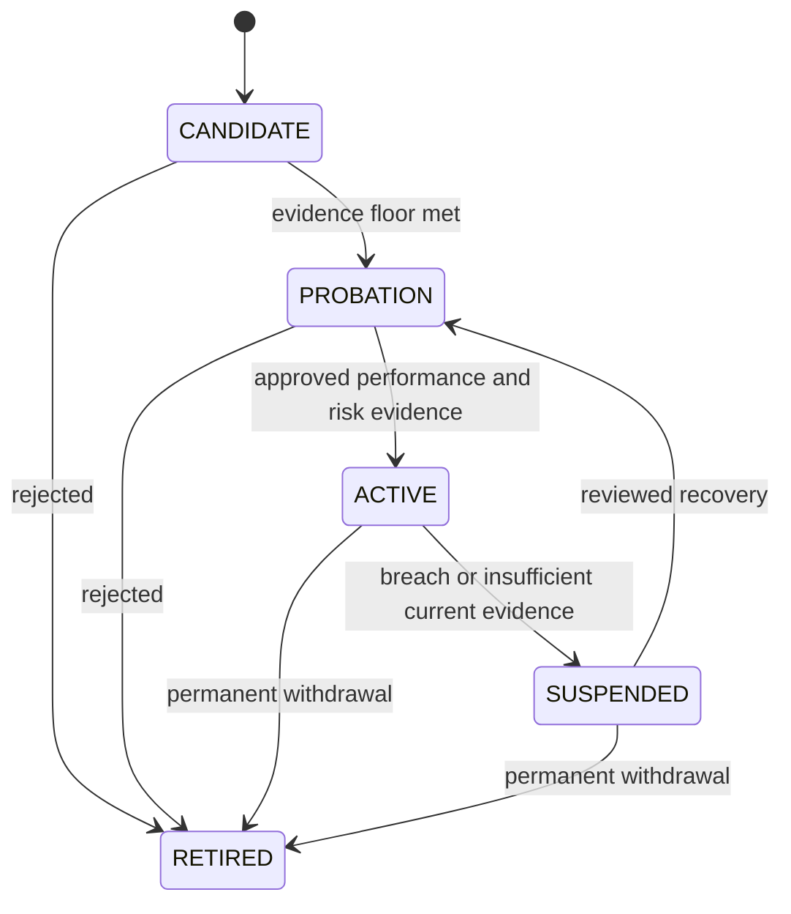

# Strategy Lifecycle

## Scope

Strategy eligibility is controlled by an explicit lifecycle using rolling evidence and minimum sample sizes.

## Assumptions

Each strategy has a versioned evidence policy constrained by platform-wide safety floors.

## Responsibilities

Lifecycle evaluation computes rolling metrics, enforces sample minimums, records evidence versions, and emits auditable transition proposals.

## Invariants

- `CANDIDATE`, `PROBATION`, `ACTIVE`, `SUSPENDED`, and `RETIRED` are distinct states.
- Insufficient evidence cannot promote a strategy.
- Global floors cannot be weakened per strategy.
- If none is eligible, the result is `NO_TRADE`.

## Failure Modes

Biased samples, stale metrics, policy changes, missing data, and manual override abuse can create false confidence. These conditions suspend or prevent promotion.

## Trade-offs

Rolling windows adapt to regime changes but can overreact; minimum sample sizes reduce noise but delay decisions.

## Unresolved Questions

Exact windows, sample floors, metrics, and approval roles require strategy-specific review.

## Acceptance Criteria

- Every transition identifies evidence, policy version, actor, reason, and time.
- Retirement is not automatically reversible.
- Candidate supply never forces active status.

## Phase 8 production candidate

`nifty-ema-crossover-paper` is the sole production candidate. Its checked-in
instance is disabled and remains a `CANDIDATE`; classification does not imply
eligibility. Enabling requires a checksum-bound configuration with a verified
tradable execution instrument, authoritative position feedback, fresh
completed-candle inputs, `NORMAL_TRADING`, non-CAS session state, and existing
Phase 3 controls. Any missing or inconsistent input produces explicit
`NO_ACTION` or blocks publication. A strategy proposal remains advisory.

Phase 8 M2 keeps EMA as a `REFERENCE_CANDIDATE`. Direction passes through the
provider-neutral derivatives selection boundary before an option proposal may
reach Phase 3. Passing PAPER evidence does not establish alpha or activate the
disabled instance.
